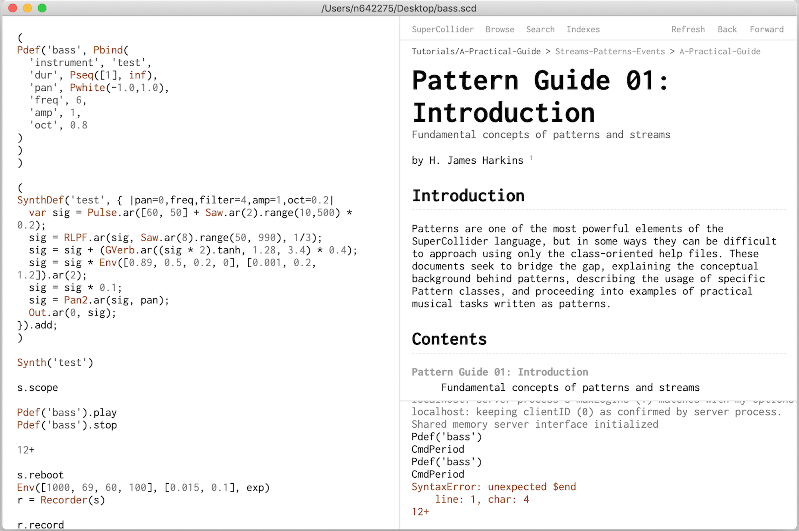

# hadron-editor

macOS editor for [SuperCollider](https://github.com/supercollider/supercollider) with built-in help browser and post window.




# installation

First install [SuperCollider](https://github.com/supercollider/supercollider) and place it under /Applications/SuperCollider/SuperCollider.app. Then download [Hadron-1.0.0.dmg](https://hermantorjussen.no/Hadron-1.0.0.dmg), open it and drag Hadron.app to /Applications. Now you can start the application, type in SuperCollider code and evaluate it with `Cmd+Enter`.

# usage

Keyboard shortcuts for common actions:

### cmd+b
Boot server

### cmd+enter
Evaluate code region

### shift+enter
Evaluate code line

### cmd+.
Hush. Free all synths. Stop all audio output

### cmd+shift+l
Recompile class library

### cmd+m
Show server meter

### cmd+shift+m
Show server scope

### cmd+l
Select current line(s)

### cmd+shift+d
Duplicate current line

### cmd+shift+k
Comment/uncomment text selection

### cmd+d
Lookup help for word under cursor

### cmd+i
Show/hide help browser

### cmd+p
Show/hide post window

### cmd+plus
Increase font size

### cmd+minus
Decrease font size

### cmd+0
Reset font size

### cmd+shift+p
Clear post window

### cmd+o
Open file

### cmd+s
Save file

### cmd+shift+s
Save file as

### cmd+q
Quit application

# developing

First you need to install [SuperCollider](https://github.com/supercollider/supercollider) and [NodeJS](https://nodejs.org/en/) on your computer. Then, with [NPM](https://www.npmjs.com/) do:

```
npm install
npm start
```

The application should start automatically.

# libraries

The editor is built with [supercolliderjs](https://github.com/crucialfelix/supercolliderjs) and [Electron](https://electronjs.org/docs). For code editing, the [codemirror](https://codemirror.net/) library is used.

# license

MIT
